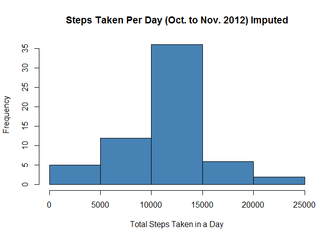
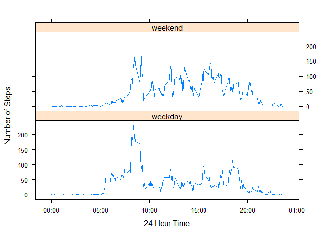

# Analyzing activity monitoring (steps) from Oct. 1 to Nov. 30 2012
Andrew F Konecny  
December 8, 2016  


## 1. Synopsis ##

Please note, based on peer review, I have corrected sections: 3.1, 3.2, 3.6 & 3.7.  I now better understand "histogram".

It is now possible to collect a large amount of data about personal movement using activity monitoring devices such as a [Fitbit](http://www.fitbit.com/ "Fitbit"), [Nike Fuelband](http://www.nike.com/us/en_us/c/nikeplus-fuelband "Nike Fuleband"), or [Jawbone Up](https://jawbone.com/up "Jawbone Up") . These type of devices are part of the "quantified self" movement - a group of enthusiasts who take measurements about themselves regularly to improve their health, to find patterns in their behavior, or because they are tech geeks. But these data remain under-utilized both because the raw data are hard to obtain and there is a lack of statistical methods and software for processing and interpreting the data.

## 2. Data Processing ##

This assignment makes use of data from a personal activity monitoring device. This device collects data at 5 minute intervals through out the day. The data consists of two months of data from an anonymous individual collected during the months of October and November, 2012 and include the number of steps taken in 5 minute intervals each day.

The data for this assignment can be downloaded from the course web site:

- Dataset: [Activity monitoring data](https://d396qusza40orc.cloudfront.net/repdata%2Fdata%2Factivity.zip "Activity monitoring data") [52K]

The variables included in this dataset are:

- **steps:** Number of steps taking in a 5-minute interval (missing values are coded as **NA**)
- **date:** The date on which the measurement was taken in YYYY-MM-DD format
- **interval:** Identifier for the 5-minute interval in which measurement was taken

The dataset is stored in a comma-separated-value (CSV) file and there are a total of 17,568 observations in this dataset.

### 2.1 Load Data ###

```r
## Set file.url with the data file link here.
file.url <- "https://d396qusza40orc.cloudfront.net/repdata%2Fdata%2Factivity.zip"

## Download the file, get unzipped file name and unzip file.
download.file(file.url, destfile = "activity_monitoring_data.zip")
name.of.csv <- unzip("activity_monitoring_data.zip", list = TRUE)
unzip("activity_monitoring_data.zip")

## Load initial data frame.
## 61 days x 288 intervals = 17,568 obs.
df.activity.monitoring.data <- read.csv(name.of.csv$Name, header = TRUE, sep = ",", stringsAsFactors = FALSE)

## This will convert a 5 minute interval to a 24 hour time.
setTime <- function(y) {
    s <- "00"
    h <- sprintf("%02d", y%/%100)
    m <- sprintf("%02d", y%%100)
    return(paste(h,":",m,":",s, sep=""))
}

## Create a POSIXct object that holds date and time.
df.activity.monitoring.data$date <- as.POSIXct(paste(df.activity.monitoring.data$date,
                                                  " ",
                                                  setTime(df.activity.monitoring.data$interval),
                                                  sep=""), format="%Y-%m-%d %H:%M:%S")

## For plotting store ymd and time as seperate variables.
df.activity.monitoring.data$ymd <- date(df.activity.monitoring.data$date)
df.activity.monitoring.data$time <- format(df.activity.monitoring.data$date, format = "%H:%M")
df.activity.monitoring.data$time <- as.POSIXct(df.activity.monitoring.data$date, format = "%H:%M")

## How many observations and variables?
read.obs  <- nrow(df.activity.monitoring.data)
read.vars <- ncol(df.activity.monitoring.data)
var.names <- names(df.activity.monitoring.data)

## Nomissing (1st part of assignemnt) and missing version (for later part of assignment) data frames.
df.activity.monitoring.data.nomissing <- subset(df.activity.monitoring.data, (!is.na(steps)))
nomissing.steps <- nrow(df.activity.monitoring.data.nomissing)

df.activity.monitoring.data.missing <- subset(df.activity.monitoring.data, (is.na(steps)))
missing.steps <- nrow(df.activity.monitoring.data.missing)
```

17568 observations read into data frame with 5 variables: steps, date, interval, ymd, time (I added the last two for plotting purposes). There are 15264 observations with no missing steps data and 2304 observations with missing steps data.

## 2.2 Process Data ##

```r
## Calculate Total (sum), Mean & Median on a non missing data frame.
df.statistics.steps.by.date.nomissing <- summaryBy(steps ~ ymd,
                                                   data =df.activity.monitoring.data.nomissing,
                                                   FUN = list(sum, mean, median),
                                                   na.rm = TRUE)

## Calculate Average (mean) steps by interval on a non missing data frame.
df.statistics.steps.by.interval.nomissing <- summaryBy(steps ~ interval,
                                                       data =df.activity.monitoring.data.nomissing,
                                                       FUN = list(mean),
                                                       na.rm = TRUE)
```

## 3. Results ##
### 3.1 What is mean total number of steps taken per day? ###

What is the difference between a histogram and a barplot? In a nutshell histograms show distributions of variables (quantitative data); whereas, barplots compare varaibles (catergorical / qualitative data).


```r
## Make a histogram of the total number of steps taken each day.
hist(df.statistics.steps.by.date.nomissing$steps.sum,
     main = "Steps Taken Per Day (Oct. to Nov. 2012) No Missing",
     xlab = "Total Steps Taken in a Day",
     col = "steelblue")
```

<!-- -->

Of interest, we can see from the plot that the mean and median will fall between 10,000 to 15,000 total steps per day.

### 3.2 Report the mean and median total steps per day. ###

```r
## Calculate the mean.
tspd.mean <- as.integer(mean(df.statistics.steps.by.date.nomissing$steps.sum))

## Calculate the median.
tspd.median <- as.integer(median(df.statistics.steps.by.date.nomissing$steps.sum))
```

So the mean total steps per day is 10766 and the median total steps per day is 10765.

### 3.3 What is the average daily activity pattern? ###

```r
## Make a time series plot (i.e. type = "l") of the 5-minute interval (x-axis) and
## the average number of steps taken, averaged across all days (y-axis).
ggplot(df.statistics.steps.by.interval.nomissing, aes(interval, steps.mean)) +
geom_line(colour = "steelblue", size = .8) +
ggtitle("Average number of steps taken by Interval (Oct - Nov 2012)") +    
xlab("5-minute interval") +
ylab("Average number of steps taken (across all days)")
```

<!-- -->

### 3.4 The 5-minute interval that, on average, contains the maximum number of steps. ###

```r
## Which observation has the maximum number of steps?
max.avg.steps.obs <- which.max(df.statistics.steps.by.interval.nomissing$steps.mean)

## Set the maximum interval for including in text.
max.avg.interval <- df.statistics.steps.by.interval.nomissing[max.avg.steps.obs, "interval"]

## Set the maximum steps.
max.avg.steps <- df.statistics.steps.by.interval.nomissing[max.avg.steps.obs, "steps.mean"]
```
The 5-minute interval: 835, on average across all days, contains the maximum number of steps: 206.1698113.


The total number of missing values (observations) in the data set is: 2304.

### 3.5 Imputing missing values ###

```r
## I will replace the missing value with the mean total steps for that interval.
## Creating a new dataset that is equal to the original dataset but with missing data filled in.
for (i in seq(1, nrow(df.activity.monitoring.data), 288)) {
    if (is.na(df.activity.monitoring.data[i,"steps"])) {
        for (j in 1:288) {
            df.activity.monitoring.data[i+j-1,"steps"] = df.statistics.steps.by.interval.nomissing[j, "steps.mean"]
        }
    } else {
        for (j in 1:288) {
            df.activity.monitoring.data[i+j-1,"steps"] = df.activity.monitoring.data[i+j-1,"steps"]
        }
    }
}

## Calculate Total (sum), Mean & Median on an imputed data frame.
df.statistics.steps.by.date.imputed <- summaryBy(steps ~ ymd,
                                                 data = df.activity.monitoring.data,
                                                 FUN = list(sum, mean, median),
                                                 na.rm=TRUE)

## Calculate Average (mean) steps by interval on an imputed data frame.
df.statistics.steps.by.interval.imputed <- summaryBy(steps ~ interval + ymd,
                                                     data = df.activity.monitoring.data,
                                                     FUN = list(mean),
                                                     na.rm = TRUE)
```

### 3.6 Histogram - Total steps each day after missing values are imputed ###

```r
## Make a histogram of the total number of steps taken each day.
hist(df.statistics.steps.by.date.imputed$steps.sum,
     main = "Steps Taken Per Day (Oct. to Nov. 2012) Imputed",
     xlab = "Total Steps Taken in a Day",
     col = "steelblue")
```

<!-- -->

Of interest, one can see that this histogram is very similar to the initial plot with no missing and no imputed data. This suggests the imputed mean and meadian will be close to the original.

### 3.7 Report the mean and median total steps per day after missing values are imputed ###

```r
## Calculate the mean.
tspd.mean <- as.integer(mean(df.statistics.steps.by.date.imputed$steps.sum))

## Calculate the median.
tspd.median <- as.integer(median(df.statistics.steps.by.date.imputed$steps.sum))
```

So the imputed mean total steps per day is 10766 and the imputed median total steps per day is 10766. Imputation added 8 missing days of data. Both these measures (mean and median) are almost identical to what they were before.  This is probably an artifact of my impute strategy which replaced missings days with with mean total steps for each interval. With the addition of 8 days of data, were you to total steps across all 61 days, this total would be higher than over the 53 days of original data.

### 3.8 Are there differences in activity patterns between weekdays and weekends? ###

```r
## Prior to calculating statistics and plotting - split data into weekday and weekend.
weekdays1 <- c('Monday', 'Tuesday', 'Wednesday', 'Thursday', 'Friday')

for (i in 1:nrow(df.statistics.steps.by.interval.imputed)) {

        if (weekdays(df.statistics.steps.by.interval.imputed[i,"ymd"]) %in% weekdays1) {
            df.statistics.steps.by.interval.imputed[i, "MF.or.SS"] <- 'weekday'
        } else {
            df.statistics.steps.by.interval.imputed[i, "MF.or.SS"] <- 'weekend'
        }
}

## Calculate Average (mean) steps by interval on an imputed data frame.
df.statistics.steps.by.interval.imputed <- summaryBy(steps.mean ~ interval + MF.or.SS,
                                                     data = df.statistics.steps.by.interval.imputed,
                                                     FUN = list(mean),
                                                     na.rm = TRUE)

## Creating panel plot to match assignment sample.
## I relabled intervals to 24 hour time to reframe observational differences.
attach(df.statistics.steps.by.interval.imputed)
xyplot(steps.mean.mean ~ interval | factor(MF.or.SS),
       type = 'l',layout = c(1,2),
       xlab = '24 Hour Time',ylab = 'Number of Steps',
       scales=list(x=list(labels=c("24:00","00:00","05:00","10:00","15:00","20:00","01:00"))))
```

<!-- -->

Yes there are differences in activity patterns between weekdays and weekends. For weekdays and weekends there is little activity from midnight to 5:00 AM.  On weekdays there is much more activity from 5:00 AM until prior to 10:00 AM. The activity level is higher and longer on weekends from 10:00 AM until 21:00.  Activity tapers off around 20:00 on weekdays.  Both then have low activity until 5:00 AM the following day.
